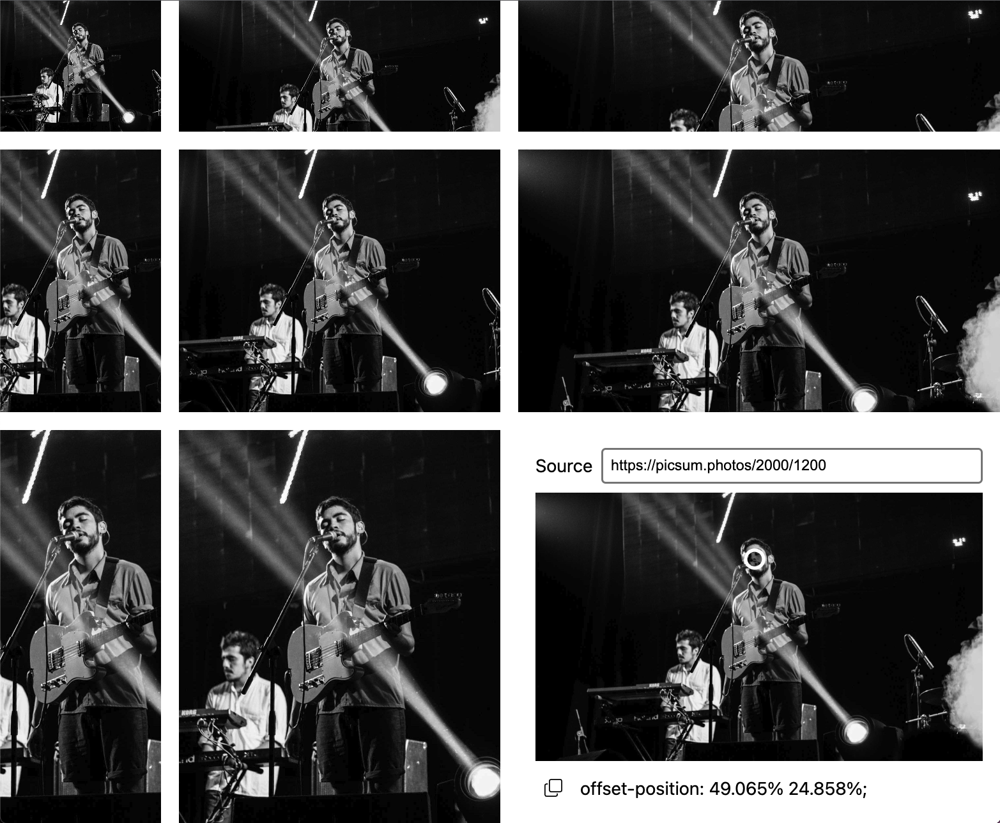

# focus-picker

[Use the focus picker tool here](https://focus-picker.pages.dev/)

This is a web component successor to [image-focus](https://github.com/third774/image-focus).

Since `object-position` can accomplish the same functionality, all that's really needed is an easy way to select the `object-position`.
